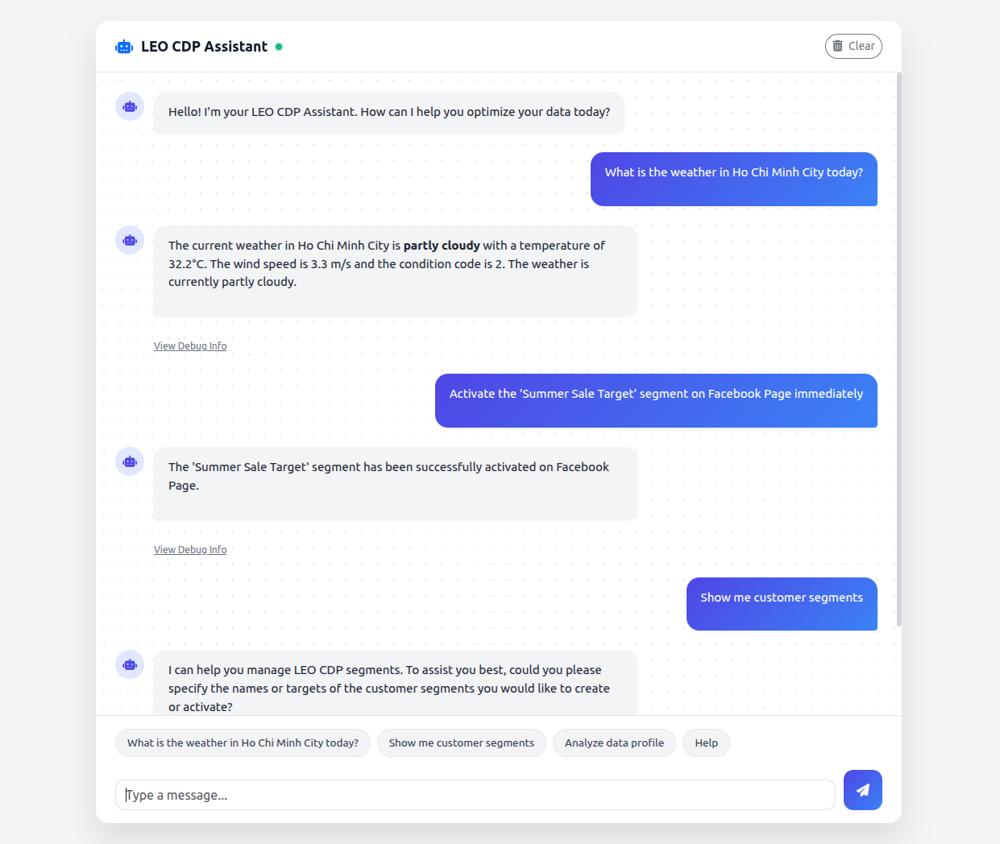

# LEO Activation Framework
### AI-driven Marketing Automation (AMA) on Graphs & Vectors

LEO Activation is an **agentic backend framework** for AI-driven marketing automation.  
It bridges **Customer Data Platforms (CDP)** and **marketing execution** using **natural language**, while keeping **data integrity, observability, and control**.

It is designed to work natively with the **LEO CDP Framework**, enabling conversational segmentation, reasoning, and omnichannel activation — without letting LLMs touch your databases directly.


---

## 🚀 Overview

LEO Activation combines:

- **PostgreSQL + Apache AGE** → customer graph & segmentation (system of truth)
- **PostgreSQL + PGVector** → semantic memory for RAG agents
- **Function-calling LLMs** → deterministic action selection
- **Strategy-based activation tools** → real marketing execution

The system runs on a guarded **four-step agent loop**:

1. **Intent & Tool Selection (FunctionGemma)**  
   Uses `google/functiongemma-270m-it` to emit structured, schema-bound function calls.

2. **Tool Execution (Backend / Developer Turn)**  
   Tools operate against:
   - Apache AGE (Cypher over PostgreSQL)
   - PostgreSQL tables
   - PGVector embeddings
   - External APIs (Zalo OA, Email, Facebook, Push)

3. **Synthesis (Gemini via LLMRouter)**  
   Gemini is used for explanation and summarization, not authority.

4. **Final Response**  
   Returns a human-readable answer with optional debug metadata.

> **Rule of the system**  
> LLMs decide *what to do*.  
> Graphs decide *what is true*.  
> Tools do the work.

---

## 🧠 Data Architecture

### Graph Intelligence (System of Truth)
- **Technology**: PostgreSQL + Apache AGE
- **Purpose**:
  - Customer profiles
  - Segment membership
  - Behavioral & relational edges
- **Why**:
  Marketing logic is graph logic.  
  Segments are projections over relationships, not flat tables.

Apache AGE allows **Cypher inside PostgreSQL**, preserving:
- ACID transactions
- One permission model
- One operational database

---

### Vector Intelligence (System of Meaning)
- **Technology**: PostgreSQL + PGVector
- **Purpose**: Semantic memory for RAG agents
- **Used for**:
  - Segment explanations
  - Campaign summaries
  - Activation reasoning
  - Agent recall

Vectors assist reasoning — they do not replace graph truth.

---

## ✨ Key Features

- **Deterministic Function Calling**  
  High-accuracy tool invocation using FunctionGemma with strict parsing and casting.

- **Hybrid LLM Routing**  
  `LLMRouter` automatically selects:
  - FunctionGemma → tool-heavy, structured actions
  - Gemini → synthesis and explanation

- **Conversational Segmentation**  
  Create, update, and reason about segments using natural language, backed by graph queries.

- **Omnichannel Activation Layer**  
  Strategy-based activation support for:
  - Email (SMTP / SendGrid)
  - Zalo OA
  - Facebook Page
  - Mobile Push
  - Web Push

- **RAG-ready by Design**  
  Background workers generate embeddings and store them in PGVector.

- **Explicit Tool Registry**  
  All tools are registered, documented, and auditable.  
  No hidden prompt magic.

---

## 🔁 AgentRouter (Core Orchestration)

`AgentRouter` is the runtime nucleus that coordinates models and tools.

**Responsibilities**:
- Detect actionable intent
- Execute tools safely
- Synthesize a final response

**Return format**:
```json
{
  "answer": "...",
  "debug": {
    "calls": [...],
    "data": [...]
  }
}
````

### Quick Example

```python
from agentic_models.router import AgentRouter
from agentic_tools.tools import AVAILABLE_TOOLS

agent = AgentRouter(mode="auto")

messages = [
  {"role": "system", "content": "You are LEO, a model that can call tools."},
  {"role": "user", "content": "Send a Zalo message to High Value users: 'Exclusive offer!'"},
]

result = agent.handle_message(
    messages=messages,
    tools=[],
    tools_map=AVAILABLE_TOOLS
)

print(result["answer"])
print(result["debug"])
```

---

## 🛠️ Installation

### Prerequisites

* Python 3.10+
* PostgreSQL 14+
* Apache AGE extension enabled
* PGVector extension enabled
* Hugging Face access to `google/functiongemma-270m-it`
* Gemini API key

### Setup Virtual Environment

```bash
python -m venv venv
source venv/bin/activate
```

### Install Dependencies

```bash
pip install --upgrade pip; pip install -r requirements.txt
```

---

## ⚙️ Configuration

Copy .env.example or create a `.env` file in the project root:

```env

# Copy this to .env and fill in secrets before running the app

# Model configuration
GEMINI_MODEL_ID=gemini-2.5-flash-lite
GEMINI_API_KEY=

# SendGrid / SMTP (Email)
EMAIL_PROVIDER=smtp            # or 'sendgrid'
SENDGRID_API_KEY=
SENDGRID_FROM=no-reply@example.com
SMTP_HOST=smtp.gmail.com
SMTP_PORT=587
SMTP_USERNAME=
SMTP_PASSWORD=
SMTP_USE_TLS=1

# Zalo OA
ZALO_OA_TOKEN=
ZALO_OA_API_URL=https://openapi.zalo.me/v3.0/oa/message/cs
ZALO_OA_MAX_RETRIES=2

# Facebook Page
FB_PAGE_ACCESS_TOKEN=
FB_PAGE_ID=

# Optional helpers
HUGGINGFACE_TOKEN=
LEO_CDP_API_URL=

# Database configuration

# PostgreSQL (Target)
PGSQL_DB_HOST=localhost
PGSQL_DB_PORT=5432
PGSQL_DB_NAME=leo_cdp
PGSQL_DB_USER=postgres
PGSQL_DB_PASSWORD=your_pg_password

# ArangoDB (Source)
ARANGO_HOST=http://localhost:8529
ARANGO_DB=leo_cdp_source
ARANGO_USER=root
ARANGO_PASSWORD=your_arango_password

# Redis (Broker & Result Backend)
REDIS_URL=redis://localhost:6379/0

# Celery specific Redis URL
CELERY_REDIS_URL=redis://localhost:6379/1

# Sync Settings
DEFAULT_TENANT_ID=00000000-0000-0000-0000-000000000000

```

Do **not** commit secrets.

---

## 🚀 Running the Server

```bash
uvicorn main:app --reload --host 0.0.0.0 --port 8000
```

---

## 💬 Usage Example



**Endpoint**: `POST /chat`

```json
{
  "prompt": "Create a High Value segment and send them a Zalo message saying: Exclusive offer just for you"
}
```

The system will:

1. Resolve or create the segment in the graph
2. Select the correct activation tool
3. Execute the delivery
4. Explain what happened

---

## 📁 Project Structure

```
.
├── main.py                 # FastAPI entrypoint
├── main_configs.py         # Centralized configuration
├── agentic_models/         # LLM engines & router
├── agentic_tools/          # Graph, activation & utility tools
├── data-workers/           # Embeddings & async jobs
├── sql-scripts/            # Apache AGE & PG schema
├── shell-scripts/          # Local infra helpers
├── api/                    # Fast API route handlers
├── test-api/               # Integration tests
└── requirements.txt
```

---

## 🧭 Design Principles

* LLMs do **not** own truth
* Graphs encode **reality**
* Vectors encode **meaning**
* Tools perform **actions**
* Prompts are **contracts**, not magic spells

LEO Activation is **not a chatbot**.
It is an **operational intelligence layer** for marketing systems.

---

## 📚 References

* [https://ai.google.dev/gemma/docs/functiongemma](https://ai.google.dev/gemma/docs/functiongemma)
* [https://ollama.com/library/functiongemma](https://ollama.com/library/functiongemma)
* [https://github.com/apache/age](https://github.com/apache/age)
* [https://github.com/pgvector/pgvector](https://github.com/pgvector/pgvector)
