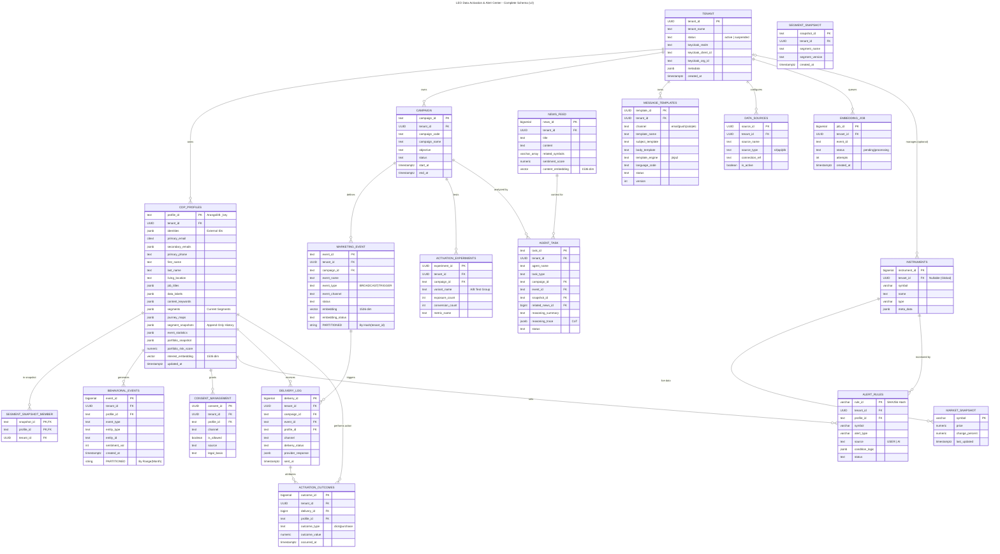

```mermaid
---
title: LEO Data Activation & Alert Center - Complete Schema (v2)
---
erDiagram

    %% ==========================================
    %% 1. CORE TENANCY (Identity & Access)
    %% ==========================================
    TENANT {
        UUID tenant_id PK
        text tenant_name
        text status "active | suspended"
        text keycloak_realm
        text keycloak_client_id
        text keycloak_org_id
        jsonb metadata
        timestamptz created_at
    }

    %% ==========================================
    %% 2. CDP PROFILES (Customer Data Platform)
    %% ==========================================
    CDP_PROFILES {
        text profile_id PK "ArangoDB _key"
        UUID tenant_id FK
        jsonb identities "External IDs"
        citext primary_email
        jsonb secondary_emails
        text primary_phone
        text first_name
        text last_name
        text living_location
        jsonb job_titles
        jsonb data_labels
        jsonb content_keywords
        jsonb segments "Current Segments"
        jsonb journey_maps
        jsonb segment_snapshots "Append-Only History"
        jsonb event_statistics
        jsonb portfolio_snapshot
        numeric portfolio_risk_score
        vector interest_embedding "1536 dim"
        timestamptz updated_at
    }

    %% ==========================================
    %% 3. CAMPAIGNS & STRATEGY
    %% ==========================================
    CAMPAIGN {
        text campaign_id PK
        UUID tenant_id FK
        text campaign_code
        text campaign_name
        text objective
        text status
        timestamptz start_at
        timestamptz end_at
    }

    MESSAGE_TEMPLATES {
        UUID template_id PK
        UUID tenant_id FK
        text channel "email|push|zalo|etc"
        text template_name
        text subject_template
        text body_template
        text template_engine "jinja2"
        text language_code
        text status
        int version
    }

    ACTIVATION_EXPERIMENTS {
        UUID experiment_id PK
        UUID tenant_id FK
        text campaign_id FK
        text variant_name "A/B Test Group"
        int exposure_count
        int conversion_count
        text metric_name
    }

    %% ==========================================
    %% 4. EXECUTION (Events & Delivery)
    %% ==========================================
    MARKETING_EVENT {
        text event_id PK
        UUID tenant_id FK
        text campaign_id FK
        text event_name
        text event_type "BROADCAST|TRIGGER"
        text event_channel
        text status
        vector embedding "1536 dim"
        text embedding_status
        string PARTITIONED "By Hash(tenant_id)"
    }

    DELIVERY_LOG {
        bigserial delivery_id PK
        UUID tenant_id FK
        text campaign_id FK
        text event_id FK
        text profile_id FK
        text channel
        text delivery_status
        jsonb provider_response
        timestamptz sent_at
    }

    ACTIVATION_OUTCOMES {
        bigserial outcome_id PK
        UUID tenant_id FK
        bigint delivery_id FK
        text profile_id FK
        text outcome_type "click|purchase"
        numeric outcome_value
        timestamptz occurred_at
    }

    %% ==========================================
    %% 5. SEGMENTATION (Static Lists)
    %% ==========================================
    SEGMENT_SNAPSHOT {
        text snapshot_id PK
        UUID tenant_id FK
        text segment_name
        text segment_version
        timestamptz created_at
    }

    SEGMENT_SNAPSHOT_MEMBER {
        text snapshot_id PK,FK
        text profile_id PK,FK
        UUID tenant_id FK
    }

    %% ==========================================
    %% 6. INTELLIGENCE (Agents, Alerts, News)
    %% ==========================================
    AGENT_TASK {
        text task_id PK
        UUID tenant_id FK
        text agent_name
        text task_type
        text campaign_id FK
        text event_id FK
        text snapshot_id FK
        bigint related_news_id FK
        text reasoning_summary
        jsonb reasoning_trace "CoT"
        text status
    }

    ALERT_RULES {
        varchar rule_id PK "SHA256 Hash"
        UUID tenant_id FK
        text profile_id FK
        varchar symbol
        varchar alert_type
        text source "USER | AI"
        jsonb condition_logic
        text status
    }

    NEWS_FEED {
        bigserial news_id PK
        UUID tenant_id FK
        text title
        text content
        varchar_array related_symbols
        numeric sentiment_score
        vector content_embedding "1536 dim"
    }

    INSTRUMENTS {
        bigserial instrument_id PK
        UUID tenant_id FK "Nullable (Global)"
        varchar symbol
        text name
        varchar type
        jsonb meta_data
    }

    MARKET_SNAPSHOT {
        varchar symbol PK
        numeric price
        numeric change_percent
        timestamptz last_updated
    }

    %% ==========================================
    %% 7. DATA PIPELINE & COMPLIANCE
    %% ==========================================
    EMBEDDING_JOB {
        bigserial job_id PK
        UUID tenant_id FK
        text event_id
        text status "pending|processing"
        int attempts
        timestamptz created_at
    }

    BEHAVIORAL_EVENTS {
        bigserial event_id PK
        UUID tenant_id FK
        text profile_id FK
        text event_type
        text entity_type
        text entity_id
        int sentiment_val
        timestamptz created_at
        string PARTITIONED "By Range(Month)"
    }

    CONSENT_MANAGEMENT {
        UUID consent_id PK
        UUID tenant_id FK
        text profile_id FK
        text channel
        boolean is_allowed
        text source
        text legal_basis
    }

    DATA_SOURCES {
        UUID source_id PK
        UUID tenant_id FK
        text source_name
        text source_type "s3|api|db"
        text connection_ref
        boolean is_active
    }

    %% ==========================================
    %% RELATIONSHIPS
    %% ==========================================

    %% Multi-tenancy Roots
    TENANT ||--o{ CDP_PROFILES : owns
    TENANT ||--o{ CAMPAIGN : owns
    TENANT ||--o{ MESSAGE_TEMPLATES : owns
    TENANT ||--o{ DATA_SOURCES : configures
    TENANT ||--o{ EMBEDDING_JOB : queues

    %% Global vs Tenant Assets
    TENANT |o--o{ INSTRUMENTS : "manages (optional)"

    %% Profile Centric
    CDP_PROFILES ||--o{ SEGMENT_SNAPSHOT_MEMBER : "in snapshot"
    CDP_PROFILES ||--o{ BEHAVIORAL_EVENTS : generates
    CDP_PROFILES ||--o{ CONSENT_MANAGEMENT : grants
    CDP_PROFILES ||--o{ ALERT_RULES : sets
    CDP_PROFILES ||--o{ DELIVERY_LOG : receives
    CDP_PROFILES ||--o{ ACTIVATION_OUTCOMES : "performs action"

    %% Campaign & Execution
    CAMPAIGN ||--o{ MARKETING_EVENT : defines
    CAMPAIGN ||--o{ ACTIVATION_EXPERIMENTS : tests
    CAMPAIGN ||--o{ AGENT_TASK : "analyzed by"
    MARKETING_EVENT ||--o{ DELIVERY_LOG : triggers
    
    %% Attribution Loop
    DELIVERY_LOG ||--o{ ACTIVATION_OUTCOMES : attributes

    %% Market Data
    INSTRUMENTS ||--o{ MARKET_SNAPSHOT : "live data"
    INSTRUMENTS ||--o{ ALERT_RULES : "monitored by"
    NEWS_FEED ||--o{ AGENT_TASK : "context for"

```