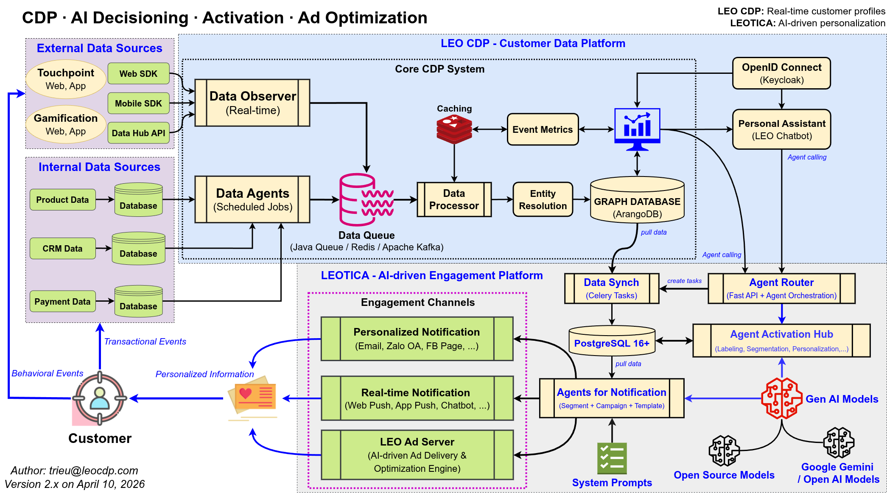
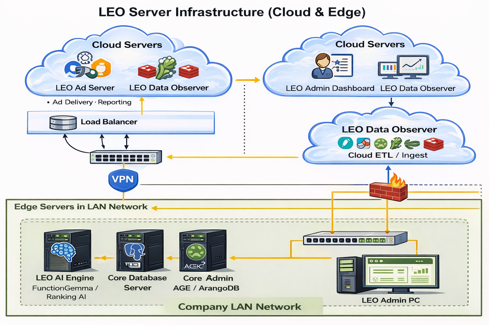

# LEO CDP + Ad Server + AI

## Kế hoạch triển khai 6 tháng

**Mục tiêu:**  
Xây dựng hệ thống **Data → Identity → Activation → Monetization → Optimization → Scale**

**Công nghệ cốt lõi:**
- CDP: PostgreSQL 16 + ArangoDB
- Activation: FastAPI + Celery + Redis
- Ad Server: Custom bidding + tracking
- AI: Gemini / FunctionGemma / Ranking Models

---

## Bức tranh tổng thể 

1. **CDP:** Hợp nhất và làm giàu dữ liệu thành profile thời gian thực  
2. **AI Decisioning:** Phân tích và ra quyết định hành động  
3. **Activation:** Thực thi hành động (Email, Zalo, Push,...)  
4. **Ad Optimization:** Tối ưu quảng cáo và phân bổ ngân sách  

---

## Servers

1. **LEO CDP Tracking:** phần tracking backend chạy trên cloud
2. **LEOTICA:**  phần ad server & notification backend chạy trên cloud
3. **AI & Database:** phần core AI & database chạy local trên server vật lý 

---

# Tổng thể kiến trúc

## Hệ thống tăng trưởng vòng kín (Closed-loop Growth System)

1. **Data Layer (CDP)** → lưu trữ và hợp nhất profile  
2. **Decision Layer (AI)** → lựa chọn hành động  
3. **Execution Layer (Activation + Ads)** → triển khai thực tế  
4. **Feedback Loop** → học và tối ưu liên tục  

> Không có feedback loop → không có AI thực sự

---

# Timeline 6 tháng

| Giai đoạn | Thời gian | Mục tiêu |
|----------|----------|----------|
| Phase 1 | Tháng 1 | Setup CDP + tracking Web (SDK, event pipeline) |
| Phase 2 | Tháng 2 | Tích hợp toàn bộ Publisher + làm giàu profile CDP |
| Phase 3 | Tháng 3 | Activation Engine (Web Push, Email, basic personalization) |
| Phase 4 | Tháng 4 | Triển khai Ad Server (inventory, format, bidding cơ bản) |
| Phase 5 | Tháng 5 | Kết nối CDP với Ad Server (targeting + tối ưu quảng cáo) |
| Phase 6 | Tháng 6 | Tối ưu & mở rộng Ad Network (scale + revenue optimization) |

---

#  Phase 1: Setup CDP + tracking Web (SDK, event pipeline) 

## Mục tiêu
Xây dựng nền tảng CDP và hệ thống tracking event real-time

### Tasks

- Thiết kế schema CDP (multi-tenant, profile, event)
- Setup PostgreSQL 16 (partition, index, RLS)
- Xây dựng Web SDK (track pageview, click, custom event)
- Xây dựng API ingest (`/track/event`)
- Setup event queue (Kafka / Redis stream)
- Chuẩn hoá event format (JSON schema)
- Logging & monitoring pipeline

### DoD

- [ ] Ingest ≥ 10k events/sec  
- [ ] Latency ingest < 200ms  
- [ ] Không mất event  
- [ ] Schema validate 100% event  

---

# Phase 2: Tích hợp Publisher + làm giàu profile CDP

## Mục tiêu
Hợp nhất identity và làm giàu dữ liệu profile

### Tasks

- Tích hợp nhiều website (Publisher SDK rollout)
- Identity resolution (cookie_id, device_id, email, phone)
- Merge profile logic (deduplication)
- Sync data ArangoDB ↔ PostgreSQL
- Enrichment data (behavior score, frequency, recency)
- Xây dựng profile API (`/profile/{id}`)
- Build segment query engine (SQL + JSONB)

### DoD

- [ ] 1 user = 1 unified profile  
- [ ] Query profile < 50ms  
- [ ] Segment query < 200ms (10k users)  
- [ ] Không duplicate profile  

---

# Phase 3: Activation Engine (Web Push, Email, personalization)

## Mục tiêu
Chuyển data thành hành động thực tế

### Tasks

- Xây dựng Segment Snapshot Engine
- Rule-based engine (trigger theo event / condition)
- Web Push integration (FCM)
- Email integration (SMTP / provider)
- Template system (jinja / dynamic content)
- Dispatcher (Celery + Redis)
- Delivery log (tracking status send)

### DoD

- [ ] Gửi push/email thành công  
- [ ] 100% action có delivery log  
- [ ] Retry fail (max 3 lần)  
- [ ] Snapshot audit được  

---

# Phase 4: Ad Server (inventory, format, bidding)

## Mục tiêu
Xây dựng hệ thống phân phối quảng cáo real-time

### Tasks

- Thiết kế Ad Inventory (placement, slot)
- Define ad formats (banner, native, popup)
- Xây dựng API `/ad/request`
- Matching logic (user → segment → ad)
- Impression tracking, click tracking
- Basic bidding (rule-based CPM/CPC)
- Frequency capping

### DoD

- [ ] Response ad < 100ms  
- [ ] Tracking impression/click chính xác  
- [ ] Không serve sai segment  
- [ ] Không mất log  

---

# Phase 5: CDP → Ads Optimization (targeting + AI)

## Mục tiêu
Dùng dữ liệu CDP để tối ưu hiệu quả quảng cáo

### Tasks

- Kết nối CDP segment vào Ad Server
- Feature engineering (CTR, CVR features)
- Ranking model (predict CTR/CVR)
- A/B testing framework
- Real-time scoring API
- Personalization ad (creative dynamic)
- Feedback loop (click → update model)

### DoD

- [ ] CTR tăng so với baseline  
- [ ] Model inference < 200ms  
- [ ] A/B test chạy được  
- [ ] Targeting chính xác theo segment  

---

# Phase 6: Tối ưu & mở rộng Ad Network

## Mục tiêu
Scale hệ thống thành Ad Network + Growth Engine

### Tasks

- Onboard nhiều Publisher
- Multi-tenant Ad Network
- Revenue tracking (ROAS, CPM, CPC)
- Auto optimization (budget allocation AI)
- Real-time dashboard (admin)
- Scale infra (load balancing, caching)
- Fraud detection (basic)

### DoD

- [ ] Scale ≥ 1M users  
- [ ] ROAS tracking real-time  
- [ ] Campaign auto-optimize  
- [ ] System stable (no downtime)  

---

# Luồng dữ liệu end-to-end

## Flow tổng thể

1. User event → CDP  
2. AI scoring → decision  
3. Activation / Ads  
4. User phản hồi  
5. Feedback vào model  

> Đây là vòng lặp sống của hệ thống

---

# Rủi ro chính

## Rủi ro kỹ thuật

- Dữ liệu không nhất quán
- Độ trễ cao
- AI hallucination

## Rủi ro kinh doanh

- Thiếu dữ liệu
- Channel bị giới hạn (Zalo, Facebook)
- ROI không rõ

---

# Chỉ số thành công

## System Metrics

- Latency < 200ms
- Uptime > 99.9%
- Data accuracy > 99%

## Business Metrics

- CTR tăng
- Conversion tăng
- CAC giảm
- LTV tăng

---

# Kết luận

## Đây không chỉ là CDP

Đây là:

> **AI-driven Growth Engine**

- Nếu chỉ có CDP → bạn chỉ đang lưu dữ liệu  
- Nếu có Activation → bạn tự động hoá hành động  
- Nếu có AI → bạn ra quyết định thông minh và tối ưu liên tục  

---

<!-- _class: final-slide -->

## Nguyên tắc triển khai

- Ship nhanh
- Đo lường mọi thứ
- Tối ưu liên tục

> **Data → Decision → Action → Feedback**