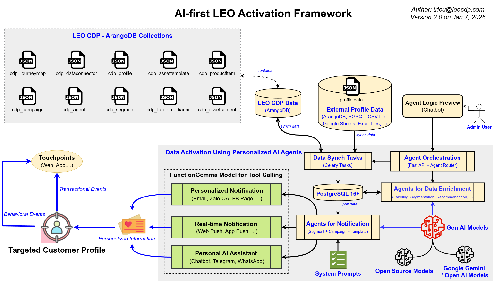

# LEO Activation Platform

## Kế Hoạch Triển Khai POC 12 Ngày

**Mục tiêu:** Xây dựng "Bộ não & Cơ bắp" AI-first cho LEO CDP.  
**Core Tech:** FunctionGemma (AI), PostgreSQL 16 (Core), Celery (Async).  
**Ràng buộc:** 12 ngày phải có Demo.

**Owner:** Product & Engineering  
**Ngày:** 8/1/2026

> **"Code wins arguments. Ship it."**

<!--
Speaker Notes:
Slide mở đầu. Nói rõ đây là POC có deadline cứng.
Không bàn mở rộng scope. Không tranh luận tool.
Mục tiêu duy nhất: ship được hệ activation chạy thật.
-->

---

## Product Vision – LEO Activation

**LEO Activation không phải là hệ gửi thông báo.**  
Nó là **Decision & Execution Engine** nằm giữa CDP và các kênh liên lạc với **customer / user**

### Chúng ta muốn giải quyết điều gì?

- CDP hiện nay **biết rất nhiều**, nhưng **làm rất ít**
- Campaign được thiết kế thủ công, **chậm và không phản hồi theo ngữ cảnh**
- Multi-channel tồn tại, nhưng **không có “bộ não” điều phối** tự động cho **personalization** theo từng profile

### LEO Activation tồn tại để:

- Biến **dữ liệu → quyết định → hành động** trong _thời gian đúng_
- Cho phép **AI ra quyết định có kiểm soát** theo kịch bản và content template, không phải đoán mò
- Mọi hành động activation đều **trace logs được – audit logs được – giải thích được lý do hành động**

> **Activation không phải là gửi tin thông báo.  
> Activation là chọn đúng hành động, cho đúng người, vào đúng thời điểm.**

<!--
Speaker Notes:
Slide này là để thống nhất tư duy trước khi xem kiến trúc.
LEO Activation không cạnh tranh với tool gửi tin.
Nó cạnh tranh với sự chậm chạp và thủ công trong việc ra quyết định.
Nếu audience chỉ nhớ 1 điều:
Activation = decision system, không phải messaging system.
-->

---

## Bức tranh tổng thể về Flow

1. **Ingest (Thu thập):** Đồng bộ dữ liệu từ LEO CDP (ArangoDB) → Postgres.
2. **Think (Tư duy):** FunctionGemma phân tích Profile + Context → Quyết định "Làm gì".
3. **Target (Nhắm mục tiêu):** Snapshot Segment (bất biến).
4. **Act (Hành động):** Dispatch tới các kênh (Chat, Zalo, Facebook, Email, Web Push, App Push).

<!--
Speaker Notes:
Slide này để mọi người cùng nhìn một bản đồ.
Không đi chi tiết kỹ thuật.
Chỉ cần hiểu activation là một luồng xuyên suốt, không phải 1 service lẻ.
-->

---

## Timeline Sprint (12 Ngày)

- **Phase 1: Nền tảng (Ngày 1-3)**
- **Phase 2: Bộ não AI (Ngày 4-7)**
- **Phase 3: Cơ bắp thực thi (Ngày 8-10)**
- **Phase 4: Ổn định hóa (Ngày 11-12)**

<!--
Speaker Notes:
Timeline này khóa cứng.
Không có chuyện “làm song song cho nhanh” nếu chưa xong phase dưới.
-->

---

# Phase 1: Nền tảng (Ngày 1-3)

## Mục tiêu: Cấu trúc database chuẩn, đầy đủ và tin cậy để scale.

<!--
Speaker Notes:
Phase này là nền tảng dữ liệu database cho quyết định toàn bộ hệ thống.
Nếu nền sai, AI phía trên chỉ là diễn.
-->

---

## [LEO Activation – 01] Khởi tạo Database & Extensions

**WHY – Vì sao task này tồn tại?**  
LEO Activation là hệ thống **AI-first Marketing Automation** để ghi nhận sự thật khi tương tác với user.
Nếu schema sai, mọi quyết định AI phía trên đều sai nhưng không ai biết.

**Mô tả:**  
Khởi tạo PostgreSQL 16 với schema production đã cung cấp. Đảm bảo kích hoạt đầy đủ extensions (`vector`, `pgcrypto`).

**Technical Tasks:**

1. Chạy `schema.sql` với Postgres 16+ instance.
2. Kiểm tra Partitioning trên bảng `marketing_event`.
3. Kiểm tra RLS (Row Level Security).

**Definition of Done (DoD):**

- [ ] `\d marketing_event` hiển thị đủ 16 partitions.
- [ ] Insert vào `cdp_profiles` chỉ thành công khi có `tenant_id` hợp lệ.
- [ ] Trigger `update_timestamp()` hoạt động đúng.

<!--
Speaker Notes:
Partition và RLS là hai thứ không sửa muộn được.
Làm đúng ngay từ POC thì production mới đỡ đau.
-->

---

## [LEO Activation – 02] Worker Đồng bộ Dữ liệu (ArangoDB → Postgres)

**WHY – Vì sao task này tồn tại?**  
Activation runtime không được phụ thuộc GraphDB. Mọi quyết định phải chạy trên dữ liệu đã ổn định.

**Mô tả:**  
Xây dựng Celery worker để kéo dữ liệu profile từ LEO CDP ArangoDB và upsert vào bảng `cdp_profiles` của Activation.

**Technical Tasks:**

1. Tạo `SyncProfileWorker`.
2. Map các thuộc tính từ Arango sang Postgres.
3. Xử lý logic `ON CONFLICT (tenant_id, ext_id)`.

**Definition of Done (DoD):**

- [ ] Độ trễ Sync < 200ms cho batch 100 profiles.
- [ ] JSONB query được qua GIN index.
- [ ] Không sinh ra profile trùng lặp.

<!--
Speaker Notes:
Đây là mạch máu.
Sync sai = AI sai = activation sai.
-->

---

## [LEO Activation – 03] Segment Snapshot Engine

**WHY – Vì sao task này tồn tại?**  
Không snapshot thì không audit được. Không audit thì không giải thích được.

**Mô tả:**  
Implement logic "đóng băng". Khi campaign kích hoạt, hệ thống phải ghi lại chính xác ai đang ở trong segment tại thời điểm đó.

**Technical Tasks:**

1. API: `POST /snapshot/create`.
2. Query profiles → insert snapshot → insert members.
3. Kiểm tra trigger `prevent_snapshot_removal`.

**Definition of Done (DoD):**

- [ ] Tạo snapshot cho 10k profiles trong < 2 giây.
- [ ] Cố tình xóa snapshot bị DB reject.
- [ ] `snapshot_id` link đúng với `tenant_id`.

<!--
Speaker Notes:
Snapshot là bằng chứng.
Sau này khách hỏi “vì sao tôi nhận tin”, câu trả lời nằm ở đây.
-->

---

# Phase 2: Bộ não AI (Ngày 4-7)

## Mục tiêu: Text-to-Function & Truy vết Quyết định.

<!--
Speaker Notes:
AI không chỉ trả lời cho vui.
AI phải ra quyết định có log, có trách nhiệm.
-->

---

## [LEO Activation – 04] FunctionGemma Model Service

**WHY – Vì sao task này tồn tại?**  
Marketing không viết code. AI phải dịch ngôn ngữ tự nhiên thành hành động có cấu trúc trong Python.

**Mô tả:**  
Deploy FunctionGemma model (qua API wrapper) để dịch intent marketing thành các function call có cấu trúc.
Đọc kỹ technical notes https://blog.google/innovation-and-ai/technology/developers-tools/functiongemma/

**Technical Tasks:**

1. Setup LLM Gateway.
2. Định nghĩa Tools/Functions Schema.
3. Implement Prompt Template sử dụng context từ `cdp_profiles`.

**Definition of Done (DoD):**

- [ ] Text → JSON Function Call đúng cú pháp.
- [ ] Latency < 2s.

<!--
Speaker Notes:
Không quan tâm AI nói hay.
Chỉ quan tâm AI gọi đúng hàm.
-->

---

## [LEO Activation – 05] Agent Task Orchestrator

**WHY – Vì sao task này tồn tại?**  
AI không lifecycle, trạng thái và trace thì trở thành hộp đen — không debug, không audit, không kiểm soát được.

**Mô tả:**  
Vòng lặp cốt lõi quản lý vòng đời của một tác vụ AI, sử dụng bảng `agent_task`.

**Technical Tasks:**

1. API `POST /activate/agent`.
2. Tạo record `agent_task`.
3. Lưu `reasoning_trace` & `reasoning_summary`.
4. Retry logic.

**Definition of Done (DoD):**

- [ ] Lưu được trace suy luận.
- [ ] Retry tối đa 3 lần.
- [ ] RLS đúng tenant.

<!--
Speaker Notes:
Agent Task là nhật ký suy nghĩ của AI.
Debug AI = đọc bảng này.
-->

---

# Phase 3: Cơ bắp thực thi (Ngày 8-10)

---

## [LEO Activation – 06] Unified Dispatcher & Delivery Log

**WHY – Vì sao task này tồn tại?**  
Mọi hành động gửi đi đều phải được ghi nhận rõ ràng.  
Nếu không lưu được delivery log trong database, hệ thống sẽ không biết đã gửi gì, gửi cho ai và kết quả ra sao.

**Mô tả:**  
Xây dựng một Dispatcher dùng Celery + Redis Queue để gửi thông báo một cách bất đồng bộ,  
đồng thời lưu đầy đủ trạng thái gửi (delivery log) vào PostgreSQL làm nguồn dữ liệu đáng tin cậy.

**Technical Tasks:**

1. Tạo Dispatcher (Factory Pattern) để gọi đúng channel adapter.
2. Đẩy tác vụ gửi vào Celery Queue (Redis làm broker).
3. Ghi delivery log với `event_id` theo cách hashing vào PostgreSQL **trước và sau** khi gọi API bên ngoài.

**Definition of Done (DoD):**

- [ ] Mỗi lần dispatch đều có bản ghi `delivery_log` được lưu thành công trong PostgreSQL.
- [ ] `delivery_log` chứa đầy đủ trạng thái gửi và phản hồi từ provider.
- [ ] Nếu không ghi được log, send task sẽ bị dừng, không gọi API bên ngoài.

<!--
Speaker Notes:
Dispatcher là nơi “ra tay”, delivery_log là nơi “ghi sổ”.
Không có log trong Postgres thì không có sự thật để tin.
Celery giúp gửi không block, nhưng database mới là nguồn dữ liệu chính.
-->

---

## [LEO Activation – 07] Channel Adapter: Zalo OA & Email

**WHY – Vì sao task này tồn tại?**  
Việt Nam = Zalo + Email. Không làm tốt thì demo không thuyết phục.

**Mô tả:**  
Implement các connector cụ thể cho thị trường Việt Nam.

**Technical Tasks:**

- Zalo Adapter.
- Email Adapter.
- Chuẩn hóa format số điện thoại (phonenumbers) và check email (email-validator)

**Definition of Done (DoD):**

- [ ] Gửi email thành công
- [ ] Gửi ZNS thành công và Zalo OA thành công cho người đã theo dõi kênh OA
- [ ] Email sai format, số phone rác không crash worker.

<!--
Speaker Notes:
Test cả case xấu nhất.
Channel hay chết vì lỗi sai data do số điện thoại và email .
-->

---

## [LEO Activation – 08] Channel Adapter: Facebook Page

**WHY – Vì sao task này tồn tại?**  
Facebook Page vẫn là kênh CSKH và remarketing quan trọng.

**Mô tả:**  
Implement adapter gửi tin nhắn qua Facebook Page API, phục vụ các use case CSKH và campaign remarketing.

**Technical Tasks:**

1. Tích hợp Facebook Page Messaging API.
2. Quản lý Page Access Token (expire / refresh).
3. Mapping `psid` từ `cdp_profiles`.
4. Xử lý lỗi phổ biến: token expired, permission denied, rate limit.

**Definition of Done (DoD):**

- [ ] Gửi message thành công tới Page Inbox.
- [ ] Token hết hạn phải log rõ lỗi, không crash worker.
- [ ] `delivery_log` ghi nhận đầy đủ response từ Meta API.

<!--
Speaker Notes:
FB Page API rất hay chết vì token và permission.
Phải log đủ để phân biệt lỗi hệ hay lỗi Meta.
Không được trộn FB logic chung với Zalo hay Email.
-->

---

## [LEO Activation – 09] Channel Adapter: Push & Telegram

**WHY – Vì sao task này tồn tại?**  
Kênh realtime giúp người dùng cảm nhận hệ thống đang phản hồi ngay lập tức, không bị “trễ” hay “im lặng”.

**Mô tả:**  
Triển khai các kênh thông báo thời gian thực để gửi phản hồi nhanh cho người dùng ngay sau khi có quyết định activation.

**Technical Tasks:**

1. Tích hợp Telegram Bot API để gửi tin nhắn trực tiếp.
2. Tích hợp Push Notification (Firebase FCM hoặc PushAlert).
3. Tách queue xử lý riêng cho các kênh realtime để không bị chậm do các tác vụ khác.

**Definition of Done (DoD):**

- [ ] Thông báo Push được gửi tới thiết bị trong vòng < 1 giây sau khi dispatch.
- [ ] Tin nhắn Telegram hiển thị đúng nội dung, không lỗi định dạng (Markdown).

<!--
Speaker Notes:
Kênh realtime tạo cảm giác “hệ đang sống”.
Nếu phản hồi chậm, người dùng sẽ nghĩ hệ bị treo hoặc lỗi,
dù logic phía sau vẫn chạy đúng.
-->

---

# Phase 4: Ổn định hóa (Ngày 11-12)

---

## [LEO Activation – 10] End-to-End Traceability Test

**WHY – Vì sao task này tồn tại?**  
Nếu không theo dõi được toàn bộ hành trình của một event, hệ thống sẽ không thể vận hành, debug hay tối ưu trong thực tế.

**Mô tả:**  
Kiểm tra khả năng truy vết đầy đủ một luồng activation hoàn chỉnh:
từ lúc event được ghi nhận → AI ra quyết định → gửi thông báo → ghi nhận kết quả.

**Definition of Done (DoD):**

- [ ] Chỉ với **một câu SQL**, có thể xem toàn bộ hành trình của một user/event.
- [ ] Không tồn tại log bị thiếu hoặc không liên kết được (orphan log).

<!--
Speaker Notes:
Task này trả lời câu hỏi: “Hệ có giải thích được chính nó không?”
Nếu product owner không trace được 1 case end-to-end, hệ chưa sẵn sàng chạy thật.
-->

---

## [LEO Activation – 11] Load Testing (Grafana k6)

**WHY – Vì sao task này tồn tại?**  
Demo chỉ có ý nghĩa khi hệ thống chịu được tải thực tế.  
Nếu không load test trước, mọi lỗi sẽ bộc lộ ngay khi đang demo.

**Mô tả:**  
Thực hiện kiểm tra tải cho luồng Activation chính để đảm bảo hệ thống hoạt động ổn định ở mức POC.  
Sử dụng **Grafana k6** để mô phỏng traffic thực tế và đo độ ổn định của hệ thống.

**Tool sử dụng:**

- Grafana k6: https://k6.io/

**Technical Tasks:**

1. Viết kịch bản load test bằng Grafana k6 cho luồng activation end-to-end.
2. Giả lập xử lý tối thiểu **5,000 profiles / phút**.
3. Theo dõi các chỉ số: response time, error rate, queue backlog (Celery).
4. Ghi nhận kết quả load test để phục vụ review trước demo.

**Definition of Done (DoD):**

- [ ] Hệ thống xử lý ổn định 5,000 profiles trong vòng 1 phút.
- [ ] Tỉ lệ lỗi API < 1% trong suốt quá trình test.
- [ ] Không xảy ra DB lock hoặc queue backlog kéo dài.

<!--
Speaker Notes:
Load test không phải để khoe số đẹp.
Nó để chắc rằng demo không sập.
Nếu fail ở đây, phải fix trước khi nói chuyện feature.
-->

---

## [LEO Activation – 12] Technical Documentation (Markdown + MkDocs)

**WHY – Vì sao task này tồn tại?**  
Hệ thống không có tài liệu thì chỉ người viết code mới hiểu.  
POC muốn bàn giao hoặc mở rộng thì bắt buộc phải có documentation rõ ràng.

**Mô tả:**  
Viết và chuẩn hoá tài liệu kỹ thuật cho LEO Activation bằng **Markdown**,  
sau đó build thành site tài liệu bằng **MkDocs** để dễ đọc và dễ cập nhật.

**Tool sử dụng:**

- MkDocs: https://www.mkdocs.org/

**Technical Tasks:**

1. Viết tài liệu kiến trúc tổng quan (Activation Flow).
2. Viết tài liệu API chính (Activation, Agent Task, Dispatcher).
3. Mô tả cấu trúc database và các bảng quan trọng.
4. Build site tài liệu bằng MkDocs (local hoặc CI).

**Definition of Done (DoD):**

- [ ] Tài liệu được viết đầy đủ bằng Markdown.
- [ ] MkDocs build thành công, truy cập được qua link nội bộ.
- [ ] Nội dung đủ để dev khác đọc và hiểu luồng hệ thống.

<!--
Speaker Notes:
MkDocs giúp tài liệu sống cùng code.
Không có doc thì mỗi lần onboarding là một lần giải thích lại từ đầu.
Task này để tiết kiệm thời gian cho tương lai.
-->

---

## Hành động ngay (Day 0)

1. **Chốt phạm vi POC & đóng scope**

   - Freeze danh sách tính năng trong tài liệu này. Nếu có yêu cầu mới → đưa sang phase sau POC.

2. **Dựng hạ tầng nền (Postgres + Queue)**

   - Provision PostgreSQL 16 + bật extensions cần thiết, khởi tạo Celery broker & worker skeleton.

3. **Verify schema & chiến lược partition**

   - Lead Dev review `schema.sql`, đặc biệt bảng `marketing_event`. Xác nhận partition, index, RLS chạy đúng ngay từ đầu.

4. **Chuẩn hoá contract dữ liệu & API**

   - Chốt format `cdp_profiles`, `agent_task`, `delivery_log`. Freeze request/response cho các API chính.

5. **Tạo backlog & phân công rõ ràng**
   - Đẩy toàn bộ task `[LEO Activation – xx]` vào Jira.
   - Gán owner rõ cho từng ticket trước khi bắt đầu Day 1.

---

<!-- _class: final-slide -->

## LEO Activation – Task Status Overview

|             Task ID | Task Name                         | Status         |
| ------------------: | --------------------------------- | -------------- |
| LEO Activation – 01 | Khởi tạo Database & Extensions    | 🟩 Done        |
| LEO Activation – 02 | Worker Đồng bộ Dữ liệu            | 🟦 In Progress |
| LEO Activation – 03 | Segment Snapshot Engine           | ⬜ Todo        |
| LEO Activation – 04 | FunctionGemma Model Service       | 🟦 In Progress |
| LEO Activation – 05 | Agent Task Orchestrator           | ⬜ Todo        |
| LEO Activation – 06 | Unified Dispatcher & Delivery Log | ⬜ Todo        |
| LEO Activation – 07 | Channel Adapter: Zalo OA & Email  | 🟦 In Progress |
| LEO Activation – 08 | Channel Adapter: Facebook Page    | ⬜ Todo        |
| LEO Activation – 09 | Channel Adapter: Push & Telegram  | ⬜ Todo        |
| LEO Activation – 10 | End-to-End Traceability Test      | ⬜ Todo        |
| LEO Activation – 11 | Load Testing (Grafana k6)         | ⬜ Todo        |
| LEO Activation – 12 | Technical Documentation (MkDocs)  | ⬜ Todo        |
