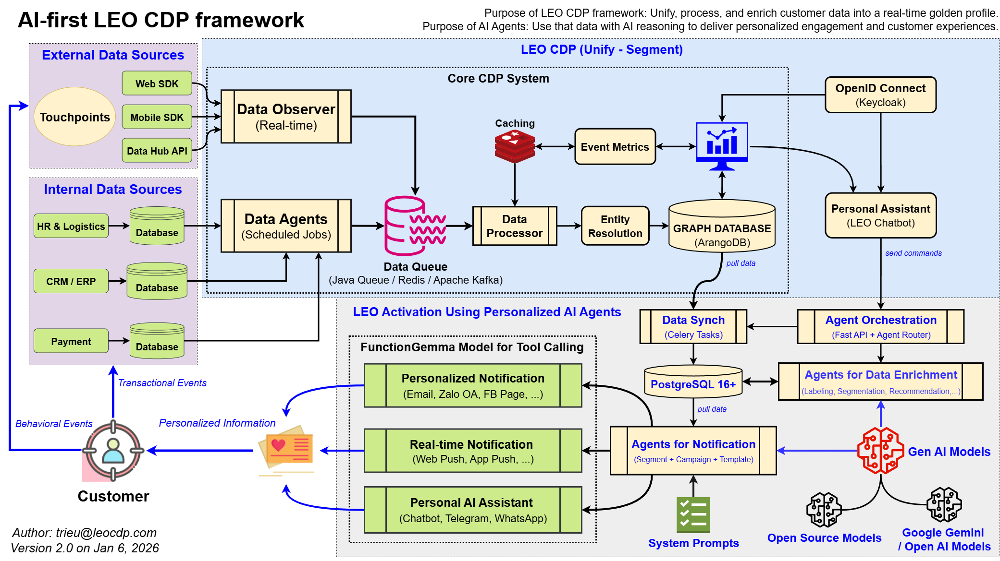

# LEO Activation  
## 12-Day Execution Plan

AI-first Customer Activation Platform  
Sprint Plan + Jira Tasks + Definition of Done  

Owner: Product / Tech  
Version: v1.0

<!--
Speaker Notes:
Slide này đặt bối cảnh. Đây không phải vision deck mà là execution plan.
Nhấn mạnh: 12 ngày là delivery sprint, không phải nghiên cứu.
Audience cần hiểu: cái này dùng để ship, không phải để tranh luận triết học.
-->

---

<!--
Speaker Notes:
Slide này dùng để anchor nhận thức chung cho cả phòng.
Không đi sâu chi tiết kỹ thuật ở đây.
Chỉ cần mọi người nhìn và hiểu:
Activation không phải 1 service đơn lẻ,
mà là luồng xuyên suốt từ Event → Decision → Channel.
-->

---

## Why LEO Activation?

- CDP không kích hoạt → chỉ là kho dữ liệu  
- Activation chậm → mất thời điểm  
- Multi-channel không orchestration → spam  

**LEO Activation = Event-driven + Agent-based + Measurable**

<!--
Speaker Notes:
Giải thích pain rất nhanh.
CDP nếu chỉ lưu dữ liệu thì không tạo ra tiền.
Activation chậm nghĩa là đúng insight nhưng sai thời điểm.
Multi-channel không orchestration thì chỉ là spam đa kênh.
LEO Activation sinh ra để giải 3 vấn đề này cùng lúc.
-->

---

## Sprint Scope (12 Days)

- **Day 1–4**: Core LEO Activation Engine  
- **Day 5–8**: Channels & Notification  
- **Day 9–12**: UAT, Load Test, Bug Fix, Release  

Ship theo chiều sâu, không dàn trải.

<!--
Speaker Notes:
Nhấn mạnh đây là scope khóa cứng.
Không mở thêm feature trong sprint này.
Ưu tiên chiều sâu: core trước, channel sau, test cuối.
Không có chuyện vừa làm core vừa đi chỉnh UI.
-->

---

## Architecture Context

Event  
→ Segment Snapshot  
→ Agent Orchestration  
→ Channel Dispatch  

Mỗi bước phải:
- Deterministic  
- Observable  
- Testable  

<!--
Speaker Notes:
Đây là backbone của toàn hệ.
Deterministic: cùng input thì ra cùng output.
Observable: có log, metric, trace.
Testable: mỗi bước phải test được độc lập.
Nếu thiếu 1 trong 3, activation sẽ thành black box.
-->

---

## Epic Breakdown

1. **Core LEO Activation**  
2. **Channels & Notification**  
3. **UAT & Stabilization**

<!--
Speaker Notes:
Chỉ có 3 epic, không nhiều hơn.
Mục đích là giữ focus.
Core mà không xong thì channel làm cũng vô nghĩa.
-->

---

## Epic 1 – Core LEO Activation

**Goal**
- Rule-based activation  
- Agent orchestration  
- Snapshot-based segmentation  

Không realtime giả. Không rule mơ hồ.

<!--
Speaker Notes:
Epic này là xương sống.
Rule-based nhưng không hardcode.
Agent orchestration để sau này mở rộng AI agent.
Snapshot để tránh “segment drift” khi gửi.
-->

---

## Task: Setup Activation DB Schema

**SQL**

Check the [SQL Scripts Documentation](../sql-scripts/README.md) for database setup.

**Tech**
- PostgreSQL 16+  
- Indexed, migration-safe  

<!--
Speaker Notes:
Schema phải làm sớm để các team khác bám vào.
delivery_log là bắt buộc để audit.
Không index đúng ngay từ đầu thì sau này chết vì performance.
-->

---

## Unit Tests – DB Schema

- Create campaign record  
- Insert `delivery_log` < 50ms  
- Rollback migration an toàn  

Không test → không ship.

<!--
Speaker Notes:
Nhấn mạnh test performance ở DB level.
Rollback migration để tránh deploy lỗi là downtime.
Không có test thì coi như task chưa xong.
-->

---

## Task: Activation Rule Engine (MVP)

**Features**
- Segment match  
- Trigger condition  
- Cooldown logic  

**Performance target**
- < 30ms / evaluation  

<!--
Speaker Notes:
MVP nhưng không được cẩu thả.
Cooldown là thứ giúp tránh spam.
30ms là để chịu được realtime event.
-->

---

## Unit Tests – Rule Engine

- Segment = true → trigger fired  
- Cooldown active → no trigger  
- Invalid rule → rejected  

<!--
Speaker Notes:
Test cả happy path và negative path.
Invalid rule phải fail sớm, không được silent.
Rule engine mà sai là gửi nhầm hàng loạt.
-->

---

## Task: Agent Orchestration API

**Endpoint**
- `POST /activate/event`

**Responsibilities**
- Create `agent_task`  
- Async dispatch  
- Retry on timeout  

<!--
Speaker Notes:
API này là cửa ngõ activation.
Không được block.
Retry logic là bắt buộc, không optional.
-->

---

## Task: Data Sync Worker

- Celery-based  
- Sync GraphDB → PostgreSQL  
- Delta only  
- Idempotent  

<!--
Speaker Notes:
Không query GraphDB trực tiếp trong activation runtime.
Worker phải idempotent để retry không tạo duplicate.
Delta sync để đảm bảo scale.
-->

---

## Task: Segment Snapshot Builder

**Principle**
- Snapshot immutable  
- Snapshot = truth tại thời điểm kích hoạt  

**Performance**
- Query < 100ms  

<!--
Speaker Notes:
Snapshot giải quyết tranh cãi: “lúc gửi thì user thuộc segment nào?”
Immutable để audit.
Không snapshot thì activation sẽ không đáng tin.
-->

---

## Task: Activation Metrics

**Track**
- Sent  
- Delivered  
- Failed  

**Tech**
- Redis cache  
- DB fallback  

<!--
Speaker Notes:
Metric không phải nice-to-have.
Nếu không đo được fail rate thì không biết hệ có đang chết hay không.
Redis chỉ là cache, DB là nguồn sự thật.
-->

---

## Task: Security – Keycloak

- OpenID Connect  
- Scope-based access  
- Không log PII  

<!--
Speaker Notes:
Activation API không auth là thảm họa.
Scope để tách quyền campaign, admin, system.
PII không bao giờ được log.
-->

---

## Epic 2 – Channels & Notification

**Channels**
- Email  
- Zalo OA  
- Facebook Page  
- Telegram  
- WhatsApp  
- Firebase Push  
- PushAlert Web Push  

Một payload. Nhiều kênh.

<!--
Speaker Notes:
Channel không phải core value, orchestration mới là core.
Thiết kế để thêm channel mới không phải sửa core.
-->

---

## Email & Zalo OA

**Email**
- SMTP / API  
- Template rendering  
- Retry on failure  

**Zalo OA**
- Token validation  
- Rate-limit handling  

<!--
Speaker Notes:
Email và Zalo là hai kênh phổ biến nhất.
Retry logic quan trọng hơn tốc độ.
Rate limit phải xử lý, không được crash.
-->

---

## Facebook Page & Telegram

**Facebook**
- Page token security  
- Delivery logging  

**Telegram**
- Bot messaging  
- Markdown support  

<!--
Speaker Notes:
FB Page token rất hay hết hạn, phải log rõ lỗi.
Telegram dễ dùng nhưng vẫn phải validate input.
-->

---

## WhatsApp & Firebase Push

**WhatsApp**
- Approved templates  
- Delivery status tracking  

**Firebase Push**
- Multicast  
- Token cleanup  

<!--
Speaker Notes:
WhatsApp cực kỳ nhạy về template.
Firebase push phải cleanup token chết để không tốn tài nguyên.
-->

---

## PushAlert & Unified Dispatcher

**PushAlert**
- Web push  
- `sw.js` compatible  

**Dispatcher**
- One payload  
- Multi-channel  
- Fallback support  

<!--
Speaker Notes:
Dispatcher là điểm khác biệt.
Một channel fail không được kéo sập toàn flow.
-->

---

## Epic 3 – UAT & Stabilization

**Goals**
- Verify end-to-end flow  
- Load safety  
- No silent failure  

<!--
Speaker Notes:
UAT không phải check UI.
UAT là kiểm tra logic, data, timing.
Silent failure là kẻ thù số 1.
-->

---

## UAT – End-to-End Activation

**Scenario**
Event  
→ Segment  
→ Agent  
→ Notification  

**Requirements**
- No manual step  
- Full traceable logs  
- SLA met  

<!--
Speaker Notes:
Flow phải chạy hoàn toàn tự động.
Log phải trace được từ event đến notification.
Không trace được = không debug được.
-->

---

## Load Test & Bug Fix

**Load**
- 1k events / minute  
- No crash  
- Queue stable  

**Bug Fix**
- No blocker  
- Regression-safe  

<!--
Speaker Notes:
1k events/phút là baseline, không phải stress tối đa.
Bug fix phải kèm test để tránh tái phạm.
-->

---

## Definition of Done (DoD)

Một task chỉ được DONE khi:

- Unit test ≥ 80%  
- Performance đạt target  
- Logs + metrics đầy đủ  
- Security enforced  
- Documentation cập nhật  

<!--
Speaker Notes:
DoD là contract, không phải guideline.
Không đạt DoD thì Jira không được Close.
PO và Tech Lead phải bảo vệ DoD này.
-->

---

## Final Principle

**LEO Activation không phải 1 system “gửi tin”.**

Nó là:
- Hệ ra quyết định  
- Hệ chọn thời điểm  
- Hệ tạo niềm tin  

> Không đo được → không phải activation.

<!--
Speaker Notes:
Slide này để chốt mindset.
Activation là decision system, không phải message system.
Nếu team nhớ được 1 câu thì nhớ câu cuối.
-->
